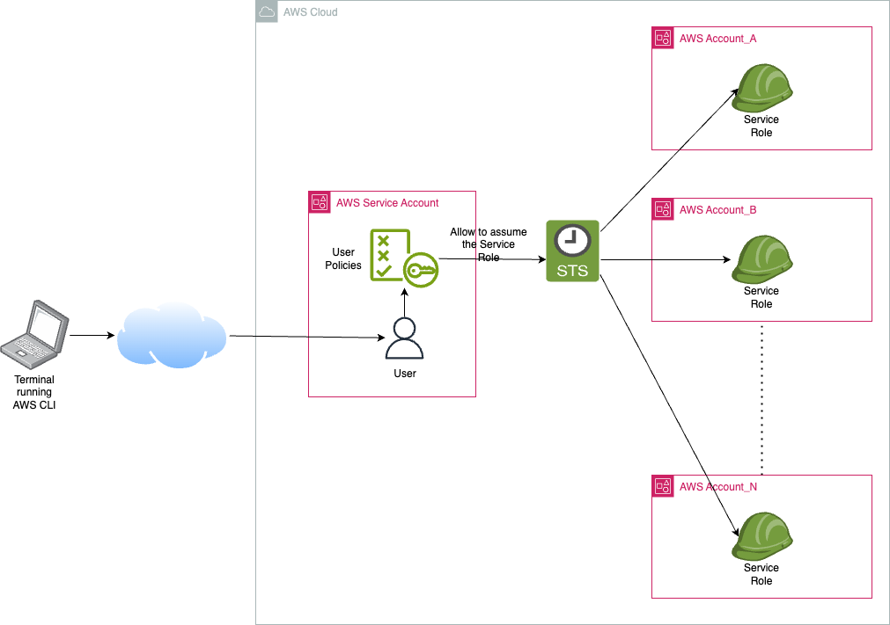

# Boto3 queries

Use Python boto3 module, AWS SDK for Python, to run CLI queries of resources deployed at an AWS Organization
or a simple list of standalone accounts.

## Pre-requisites

* Python 3.12 or greater
* AWS CLI installed in your computer.
* A valid AWS cli profile (either SSO or IAM user), this profile should allow you to authenticate
with a Service Acccount that will need enough permissions to assume an IAM Service Role on each
target account.
* An IAM Service Role at each target account in your organization with permissions to run the queries,
ideally only the permisssions required to query the services included in the script.



## Required Python modules

* boto3
* botocore
* click
* python-dateutil

**Note:** Check the `requirements.txt` file in case you have some package version issue.

## Consider to install pre-commit

If you are planning to enhance this code it is highly recommended to install [pre-commit](https://pre-commit.com/index.html)
 to speed up development and keep some standard coding style.

[](https://github.com/pre-commit/pre-commit)

## Query AWS Resources

This python script will run a query of the selected AWS resource across all enabled regions in an
 Organization using parallel processing code, it certainly runs fast though.

Please update your specific AWS settings in the `helpers/config.py` file before run it:

```bash
$ python boto3_query.py --help

Usage: boto3_query.py [OPTIONS]

  Run an AWS resource query by service name.

Options:
  -n, --name [ec2|ami|ebs_volume|ebs_volume_snap|fsx|eni|elb|elb_v2|ssm_inventory|ssm_patching|s3_bucket|rds|dynamodb|vpc|vpc_flow_logs|vpc_peering|vpc_dhcp|vpce|subnet|sec_group|tgw|igw|nat_gw|tgw_attach|route_table|vpn|dx_connections|dx_gateway|dx_gateway_attach|dx_vgw|dx_vif|r53_hosted_zones|cfn_stack|cfn_stack_set|aws_backup|aws_config|tag_editor|storage_gw|health|ram|iam_user|iam_roles|iam_sso_user|iam_sso_group|iam_sso_permission_sets|iam_sso_account_assignments]
                                  Query name to run  [default: ec2]
  -s, --session_type [sso|cli]    Select authentication type sso: Identity
                                  Center or cli: Access Keys  [default: sso]
  -a, --account TEXT              AWS Account ID in the Organization to run
                                  the query.
  -r, --region TEXT               AWS Region  [default: ap-southeast-2]
  --help                          Show this message and exit.
```

### Usage examples

First step is to authenticate against your AWS Service account, in this example is a SSO login:

```bash
> aws sso login --profile CLI_PROFILE_NAME
```

**Note:** This command will ask you to authenticate with your AWS account and save the generated temporary
Access Keys in a cache folder, and this is the normal behaviour of the AWS CLI command. Then the script
will use that cached keys until those expire and then you'll need to login again.

Second step is to run a query for example in this case we will gather VPC details from all the accounts
in the organization and all the enabled regions:

```bash
> python boto3_query.py -n vpc
```

If you want to narrow down your query to an specific account and/or region you will add a couple of options

```bash
> python boto3_query.py -n vpc -a 123456789012 -r us-east-1
```

## Author and Lincense

This script has been written by [Ariel Jall](https://github.com/ArielJalil) and it is released under
 [GNU 3.0](https://www.gnu.org/licenses/gpl-3.0.en.html).
